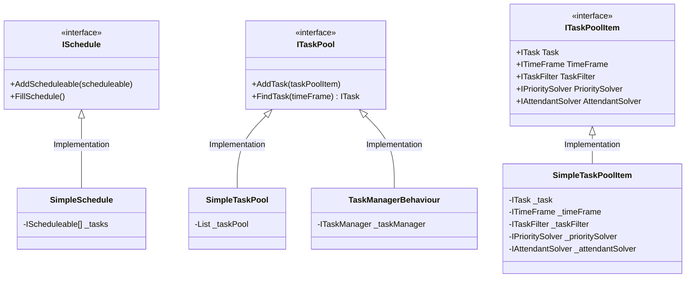
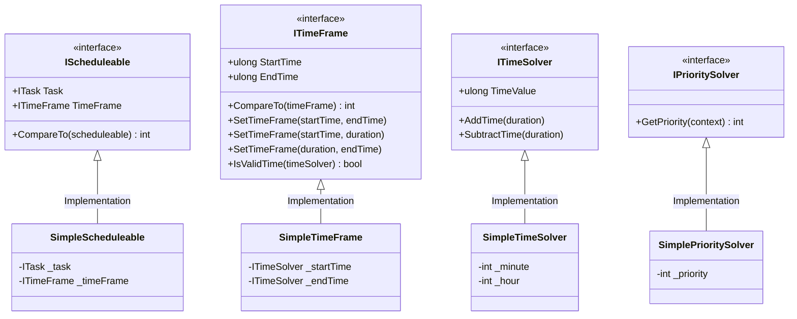
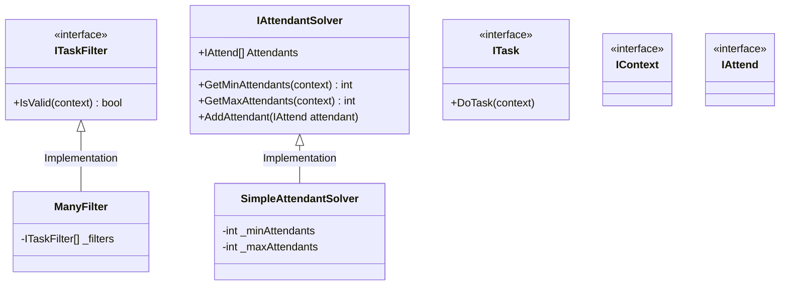
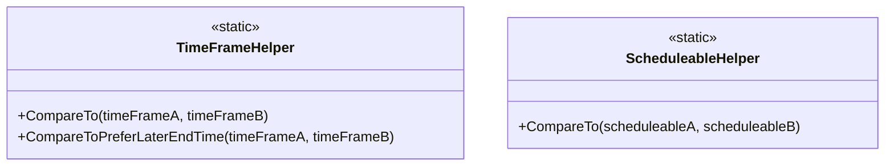

```mermaid
classDiagram
	ISchedule <|-- SimpleSchedule : Implementation
	ITaskPool <|-- SimpleTaskPool : Implementation
	ITaskPool <|-- TaskManagerBehaviour : Implementation
	ITaskPoolItem <|-- SimpleTaskPoolItem : Implementation
	class ITaskPool {
		<<interface>>
		+AddTask(taskPoolItem)
		+FindTask(timeFrame) ITask
	}
	class ITaskPoolItem {
		<<interface>>
		+ITask Task
		+ITimeFrame TimeFrame
		+ITaskFilter TaskFilter
		+IPrioritySolver PrioritySolver
		+IAttendantSolver AttendantSolver
	}
	class ISchedule {
		<<interface>>
		+AddScheduleable(scheduleable)
		+FillSchedule()
	}
	class SimpleSchedule {
		-IScheduleable[] _tasks
	}
	class SimpleTaskPool {
		-List<ITaskPoolItem> _taskPool
	}
	class SimpleTaskPoolItem {
		-ITask _task
		-ITimeFrame _timeFrame
		-ITaskFilter _taskFilter
		-IPrioritySolver _prioritySolver
		-IAttendantSolver _attendantSolver
	}
	class TaskManagerBehaviour {
		-ITaskManager _taskManager
	}
```

```mermaid
classDiagram
	IScheduleable <|-- SimpleScheduleable : Implementation
	ITimeFrame <|-- SimpleTimeFrame : Implementation
	ITimeSolver <|-- SimpleTimeSolver : Implementation
	IPrioritySolver <|-- SimplePrioritySolver : Implementation
	class IScheduleable {
		<<interface>>
		+CompareTo(scheduleable) int
		+ITask Task
		+ITimeFrame TimeFrame
	}
	class ITimeFrame {
		<<interface>>
		+CompareTo(timeFrame) int
		+ulong StartTime
		+ulong EndTime
		+SetTimeFrame(startTime, endTime)
		+SetTimeFrame(startTime, duration)
		+SetTimeFrame(duration, endTime)
		+IsValidTime(timeSolver) bool
	}
	class ITimeSolver {
		<<interface>>
		+ulong TimeValue
		+AddTime(duration)
		+SubtractTime(duration)
	}
	class IPrioritySolver {
		<<interface>>
		+GetPriority(context) int
	}
	class SimpleScheduleable {
		-ITask _task
		-ITimeFrame _timeFrame
	}
	class SimpleTimeFrame {
		-ITimeSolver _startTime
		-ITimeSolver _endTime
	}
	class SimpleTimeSolver {
		-int _minute
		-int _hour
	}
	class SimplePrioritySolver {
		-int _priority
	}
```

```mermaid
classDiagram
	ITaskFilter <|-- ManyFilter : Implementation
	IAttendantSolver <|-- SimpleAttendantSolver : Implementation
	class ITaskFilter {
		<<interface>>
		+IsValid(context) bool
	}
	class IAttendantSolver {
		+IAttend[] Attendants
		+GetMinAttendants(context) int
		+GetMaxAttendants(context) int
		+AddAttendant(IAttend attendant)
	}
	class ITask {
		<<interface>>
		+DoTask(context)
	}
	class IContext {
		<<interface>>
	}
	class IAttend {
		<<interface>>
	}
	class ManyFilter {
		-ITaskFilter[] _filters
	}
	class SimpleAttendantSolver {
		-int _minAttendants
		-int _maxAttendants
	}
```

```mermaid
classDiagram
	class TimeFrameHelper {
		<<static>>
		+CompareTo(timeFrameA, timeFrameB)
		+CompareToPreferLaterEndTime(timeFrameA, timeFrameB)
	}
	class ScheduleableHelper {
		<<static>>
		+CompareTo(scheduleableA, scheduleableB)
	}
```